# taskmaster

## Overview

This is an application used to mange the tasks.

## Lab 26

### Feature Tasks

#### Homepage

The main page should have a heading at the top of the page, an image to mock the “my tasks” view, and buttons at the bottom of the page to allow going to the “add tasks” and “all tasks” page.

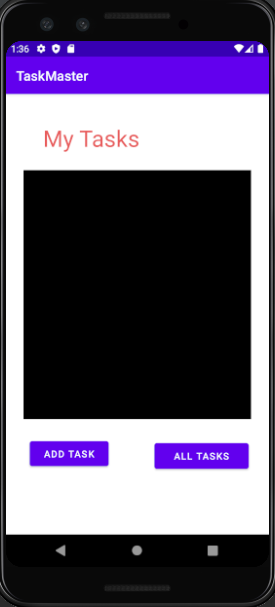

#### Add a Task

On the “Add a Task” page, allow users to type in details about a new task, specifically a title and a body. When users click the “submit” button, show a “submitted!” label on the page.

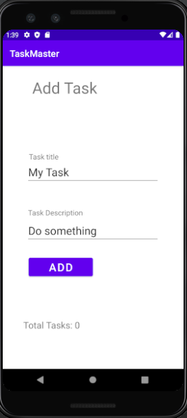

#### All Tasks

The all tasks page should just be an image with a back button; it needs no functionality.

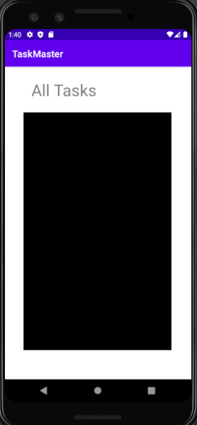

## Lab 27

### Feature Tasks for this lab

#### Task Detail Page

Task Detail page should have a title at the top of the page, and a Lorem Ipsum description.

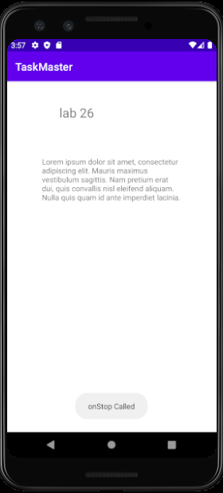

#### Settings Page

Settings page should allow users to enter their username and hit save.

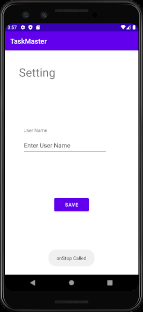

#### Homepage(1)

The main page should be modified to contain three different buttons with hardcoded task titles. When a user taps one of the titles, it should go to the Task Detail page, and the title at the top of the page should match the task title that was tapped on the previous page.

The homepage should also contain a button to visit the Settings page, and once the user has entered their username, it should display “{username}’s tasks” above the three task buttons

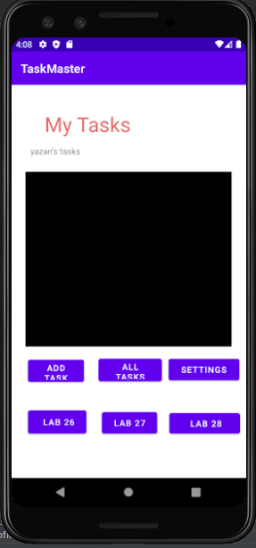

## Lab 28

### Feature Tasks for lab 28

#### Task Model

Create a Task class. A Task should have a title, a body, and a state. The state should be one of “new”, “assigned”, “in progress”, or “complete”.

[Task Model](app/src/main/java/com/example/taskmaster/Models/Task.java)

#### Homepage for lab 28

Refactor your homepage to use a RecyclerView for displaying Task data. This should have hardcoded Task data for now.

Some steps you will likely want to take to accomplish this:

Create a ViewAdapter class that displays data from a list of Tasks.
In your MainActivity, create at least three hardcoded Task instances and use those to populate your RecyclerView/ViewAdapter.
Ensure that you can tap on any one of the Tasks in the RecyclerView, and it will appropriately launch the detail page with the correct Task title displayed.

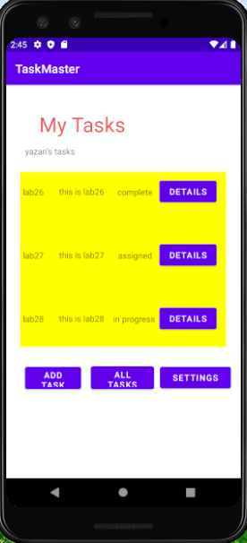

## Lab 29

### Feature Tasks for lab 29

#### Task Model and Room

Following the directions provided in the Android documentation, set up Room in your application, and modify your Task class to be an Entity.

[Task Model](app/src/main/java/com/example/taskmaster/Models/Task.java)

#### Add Task Form

Modify your Add Task form to save the data entered in as a Task in your local database.

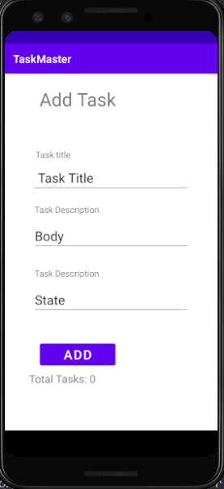

#### Homepage new

Refactor your homepage’s RecyclerView to display all Task entities in your database.

#### Detail Page new

Ensure that the description and status of a tapped task are also displayed on the detail page, in addition to the title. (Note that you can accomplish this by passing along the entire Task entity, or by passing along only its ID in the intent.)

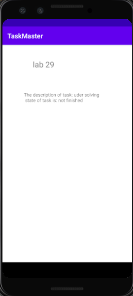

## Lab 32

### Feature Tasks for lab 32

#### Tasks Are Cloudy

Using the amplify add api command, create a Task resource that replicates our existing Task schema. Update all references to the Task data to instead use AWS Amplify to access your data in DynamoDB instead of in Room.

#### Add Task Form edited

Modify your Add Task form to save the data entered in as a Task to DynamoDB.

#### Homepage edited

Refactor your homepage’s RecyclerView to display all Task entities in DynamoDB.

## Lab 33

### Feature Tasks for lab 33

#### Tasks Are Owned By Teams

Create a second entity for a team, which has a name and a list of tasks. Update your tasks to be owned by a team.

Manually create three teams by running a mutation exactly three times in your code. (You do NOT need to allow the user to create new teams.)

#### Add Task Form(edit)

Modify your Add Task form to include either a Spinner or Radio Buttons for which team that task belongs to.

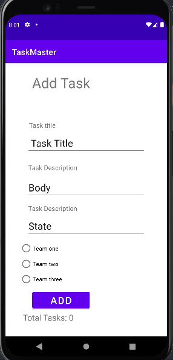

#### Settings Page(edit)

In addition to a username, allow the user to choose their team on the Settings page. Use that Team to display only that team’s tasks on the homepage.

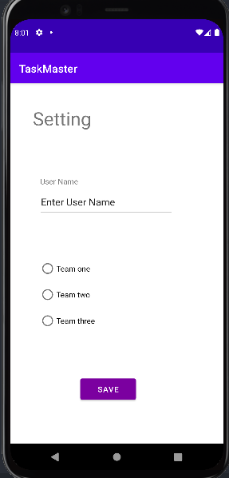